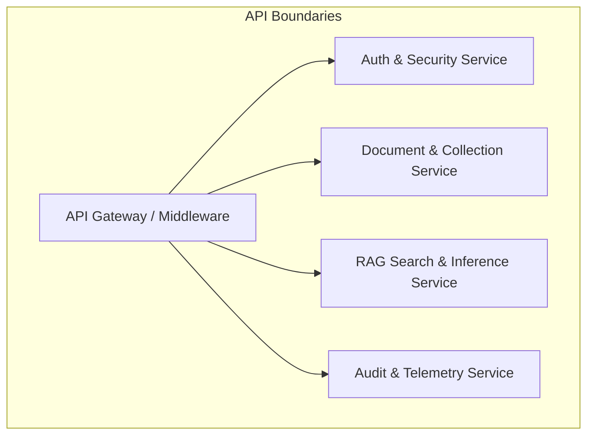
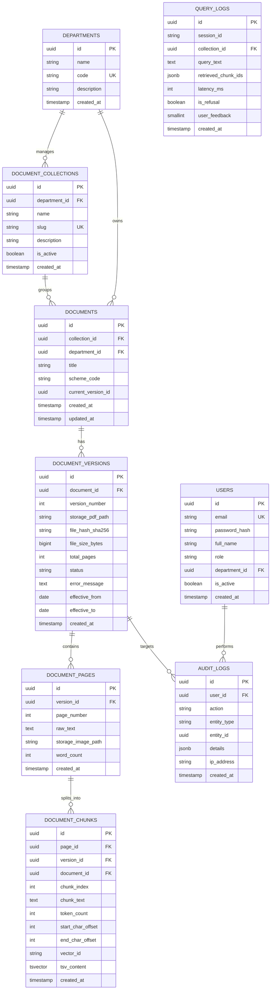
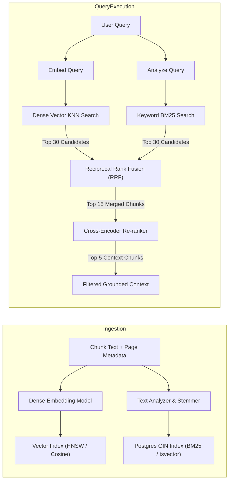
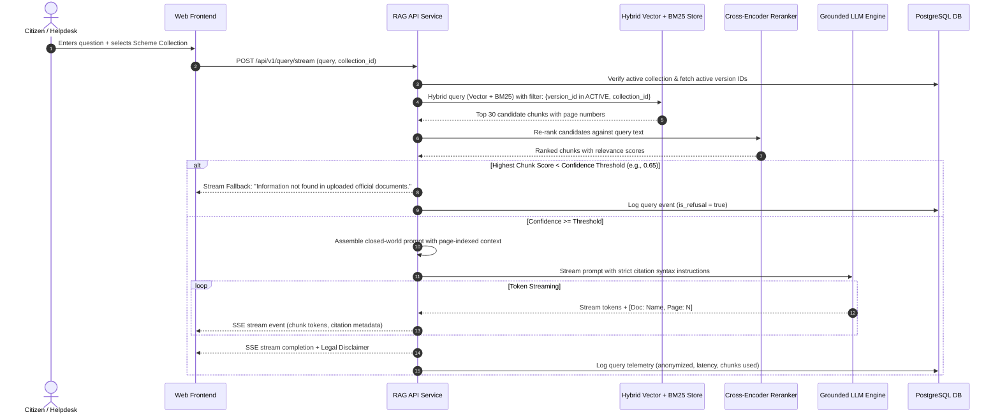

# Technical Architecture Document

## Project: Government Welfare Scheme Document Assistant (WelfareConnect)
**Target Platform:** Web Application (Responsive Desktop & Mobile Web)  
**Document Status:** Architecture Design Baseline (v1.0.0)  
**Companion Artifact:** [`docs/data-flow.mmd`](file:///e:/S67-0926-Dataforge-AiRag-WelfareConnect-/docs/data-flow.mmd)

---

## 1. System Architecture Overview

WelfareConnect is designed as a secure, high-accuracy, document-grounded Retrieval-Augmented Generation (RAG) platform. It allows authorized government administrators to upload and manage official scheme PDFs, while providing citizens and helpdesk staff with a conversational interface that guarantees:
1. Strict grounding in uploaded official documents (closed-world assumption).
2. Explicit citations with document names and exact page numbers.
3. Automated fallback refusal when information is absent.
4. Non-guarantee legal disclaimers on every answer.

```
+---------------------------------------------------------------------------------------------+
|                                    PRESENTATION LAYER                                       |
|  +---------------------------------------+   +-------------------------------------------+  |
|  |  Citizen & Helpdesk Web Interface     |   |     Admin Ingestion & Management Portal   |  |
|  |  (Search, Chat, Citation Drawer, PDF) |   |     (Upload, Collections, Versions, Logs) |  |
|  +---------------------------------------+   +-------------------------------------------+  |
+----------------------------------------------+----------------------------------------------+
                                               | HTTPS / SSE (TLS 1.3)
+----------------------------------------------v----------------------------------------------+
|                                  API & APPLICATION LAYER                                    |
|  +---------------------+  +------------------------+  +----------------------------------+  |
|  | Auth & Rate Limiter |  | Document Management API|  | RAG Query & Stream API (SSE)     |  |
|  | (JWT / Token Bucket)|  | (Collections, Versions)|  | (Hybrid Search, Grounded Prompt) |  |
|  +---------------------+  +------------------------+  +----------------------------------+  |
+----------------------------------------------+----------------------------------------------+
                                               |
        +--------------------------------------+--------------------------------------+
        |                                                                             |
+-------v--------------------------------------+      +-------------------------------v-------+
|        ASYNC PROCESSING PIPELINE             |      |             STORAGE & AI TIER         |
|  +----------------------------------------+  |      |  +---------------------------------+  |
|  | Redis Job Queue (BullMQ / Celery)      |  |      |  | PostgreSQL 16 (Relational DB)   |  |
|  +----------------------------------------+  |      |  | Metadata, Pages, Chunks, Audits |  |
|  +----------------------------------------+  |      |  +---------------------------------+  |
|  | Ingestion Workers:                     |  |      |  +---------------------------------+  |
|  | - PDF Validator & Page Splitter        |  |      |  | S3 / MinIO Object Storage       |  |
|  | - OCR & Table Extractor                |  |      |  | Raw PDFs, Page WebP, JSON       |  |
|  | - Semantic Page-Aware Chunker          |  |      |  +---------------------------------+  |
|  | - Dense Vector & BM25 Generator        |  |      |  +---------------------------------+  |
|  +----------------------------------------+  |      |  | Qdrant / pgvector (Vector Store)|  |
|                                              |      |  +---------------------------------+  |
|                                              |      |  +---------------------------------+  |
|                                              |      |  | Grounded LLM & Re-ranker Cloud  |  |
|                                              |      |  +---------------------------------+  |
+----------------------------------------------+      +---------------------------------------+
```

---

## 2. Frontend Components (Web Application)

The frontend is implemented as a responsive, modern web application optimized for desktop browsers, counter-helpdesk terminals, and mobile web viewports.

### 2.1 Citizen & Helpdesk Public Portal
- **Scheme Directory & Collection Browser:** Allows browsing available welfare schemes grouped by issuing department (e.g., Agriculture, Housing, Social Welfare).
- **Scope & Filter Selector:** Dynamic dropdown/combobox allowing users to target queries to "All Schemes", a specific scheme collection, or a single official document.
- **Natural Language Query Interface:** Clean query input box with suggestion prompts for common questions (eligibility criteria, income limits, required certificates, application deadlines).
- **Conversational Stream Renderer:** Real-time token streaming using Server-Sent Events (SSE) with markdown formatting, bullet points, and highlight callouts.
- **Citation Badges:** Clickable inline pills attached to factual statements, styled as `[Doc: <Scheme Name>, Page <N>]`.
- **Citation & PDF Page Inspector (Drawer/Modal):** Displays the high-resolution rendered page image and highlighted extracted text for instant visual verification.
- **Non-Guarantee Legal Disclaimer Banner:** Persistent banner stating that answers are informational summaries and do not constitute legal eligibility guarantees.
- **Export & Print Toolkit:** Format-optimized print/copy action generating structured handouts with full citations for helpdesk counter staff.

### 2.2 Admin Ingestion & Management Portal
- **Admin Auth Gate:** Secure login interface with session management and password reset.
- **Document Ingestion Dashboard:** Drag-and-drop PDF uploader with input fields for Scheme Title, Department, Effective Date, Document Type, and Collection Tag.
- **Real-Time Ingestion Pipeline Tracker:** Visual multi-stage status indicator (`Uploaded` $\rightarrow$ `Validating` $\rightarrow$ `OCR & Page Split` $\rightarrow$ `Embedding` $\rightarrow$ `Active`).
- **Collection & Version Management Table:** Allows viewing document versions, activating newer circulars, deprecating superseded guidelines, or triggering re-indexing.
- **Ingestion Test Sandbox:** Isolated query console for administrators to verify citations on newly uploaded documents before publishing.
- **Audit & Analytics Viewer:** Displays administrative actions, ingestion logs, failure alerts, and anonymized query volume statistics.

---

## 3. Backend Services and API Boundaries

The backend is architected as modular services (or a modular monolith) with clean separation of concerns and well-defined interface boundaries.



### 3.1 Service Boundaries

| Service Name | Responsibility | Interfaces / Protocols |
| :--- | :--- | :--- |
| **API Gateway & Auth Middleware** | Request routing, TLS termination, Rate Limiting (Token Bucket), JWT validation, and RBAC enforcement. | HTTP/2, REST |
| **Document & Collection Service** | Handles PDF upload, metadata validation, document lifecycle (Active, Deprecated, Archived), and S3/DB synchronization. | REST, S3 API, Redis Job Producer |
| **Ingestion Worker Service** | Asynchronous background processing: PDF parsing, page splitting, OCR, layout extraction, semantic chunking, and embedding generation. | Redis Job Consumer, PostgreSQL, Vector Store |
| **RAG & Search Service** | Hybrid search execution (Dense + BM25), reciprocal rank fusion (RRF), cross-encoder reranking, prompt synthesis, and LLM streaming. | REST, SSE (`text/event-stream`), LLM API |
| **Audit & Telemetry Service** | Records administrative changes and anonymized query metrics without capturing citizen PII. | Asynchronous internal event bus / PostgreSQL |

### 3.2 Key API Endpoints

#### Public / Citizen APIs (Read-Only, Rate-Limited)
- `GET /api/v1/collections`: List all active scheme collections and categories.
- `GET /api/v1/documents`: List active public scheme documents with metadata.
- `POST /api/v1/query/stream`: Submit a question and receive a Server-Sent Events (SSE) stream of grounded text and citation tokens.
  - *Request Body:* `{"query": string, "collection_id"?: string, "document_ids"?: string[], "session_id": string}`
- `GET /api/v1/documents/{document_id}/pages/{page_number}`: Retrieve rendered page image and OCR text for citation verification.

#### Administrative APIs (Authenticated & Authorized)
- `POST /api/v1/auth/login`: Admin authentication, returns access JWT and sets HttpOnly refresh token cookie.
- `POST /api/v1/admin/documents/upload`: Multipart upload of PDF with schema metadata.
- `GET /api/v1/admin/documents`: List all documents across all statuses (`PROCESSING`, `ACTIVE`, `DEPRECATED`, `FAILED`).
- `PUT /api/v1/admin/documents/{document_id}/status`: Activate, deprecate, or archive a specific document version.
- `POST /api/v1/admin/documents/{document_id}/reindex`: Trigger background re-indexing of a document version.
- `GET /api/v1/admin/audit-logs`: Paginated access to administrative audit logs.

---

## 4. Database Schema & Data Models (PostgreSQL)

The relational schema maintains strict relationships between departments, collections, documents, versions, individual pages, text chunks, and audit logs.



---

## 5. Object Storage Layout (S3 / MinIO)

All physical binary files, extracted page images, and structured JSON representations are stored in an S3-compatible object store using a deterministic, version-isolated hierarchy.

```
s3://welfareconnect-storage/
├── raw-documents/
│   └── {collection_id}/
│       └── {document_id}/
│           └── v{version_number}/
│               └── original_{filename}.pdf
├── page-artifacts/
│   └── {document_id}/
│       └── v{version_number}/
│           ├── pages/
│           │   ├── page-001.webp         # Rendered 150 DPI preview for citation drawer
│           │   ├── page-001.json         # Raw bounding boxes & OCR text
│           │   ├── page-002.webp
│           │   └── page-002.json
│           └── thumbnails/
│               └── cover_thumbnail.webp  # Catalog thumbnail
└── temp-uploads/
    └── {upload_session_id}/              # Staging area prior to validation & hash check
        └── incoming.pdf
```

### Storage Security & Policies:
- **Server-Side Encryption:** All objects encrypted with SSE-S3 (AES-256) or AWS KMS.
- **Immutability:** Once a version moves to `ACTIVE`, objects in `raw-documents/` and `page-artifacts/` are marked read-only.
- **Presigned URLs:** Secure, time-limited presigned GET URLs (5-minute expiry) are generated for the frontend citation drawer to fetch page images.

---

## 6. Document-Processing Pipeline

The ingestion pipeline converts raw official PDF circulars into structured, searchable, page-attributed vector and keyword chunks.

```
[Admin PDF Upload]
       |
       v
(1. Ingestion Gate) ------> Validate Magic Bytes (PDF-1.4 - 1.7), Virus Scan (ClamAV), Compute SHA-256
       |
       v
(2. Storage & Staging) ---> Write to S3 raw-documents/ & insert DB version record ('PROCESSING')
       |
       v
(3. Page Splitter) -------> Split PDF into per-page sub-documents & render WebP page images (150 DPI)
       |
       v
(4. Extraction Engine) ---> Extract text layers via PyMuPDF / pdfplumber.
                            If text density < threshold (scanned image), route to Tesseract OCR.
                            Detect tables and format as structured Markdown tables.
       |
       v
(5. Semantic Chunker) ----> Split page text into 400-600 token chunks with 50-token overlap.
                            NEVER cross page boundaries within a single chunk.
                            Inject chunk header: "[Document: {title}, Department: {dept}, Page: {page_num}]".
       |
       v
(6. Embedding & Index) ---> Compute dense vector (text-embedding-3-small, 1536-dim).
                            Generate PostgreSQL tsvector for keyword search.
                            Upsert into Vector DB with payload {doc_id, version_id, page_num, is_active}.
       |
       v
(7. Activation) ----------> Atomic DB transaction: mark version 'ACTIVE', deprecate older version, log audit event.
```

---

## 7. Keyword and Vector Indexing Flow

To ensure high recall for both semantic conceptual inquiries and exact government acronyms/numbers (e.g., "Form 16-B", "PMAY-G 2024", "₹2,50,000"), the system employs **Hybrid Search (Dense Vector + BM25 Full-Text Search)**.



### 7.1 Indexing Specifications
- **Dense Embeddings:** 1536-dimension embeddings generated using standard embedding models (e.g., `text-embedding-3-small` or self-hosted `bge-m3`).
- **Full-Text Index:** PostgreSQL `tsvector` with English and multi-language configuration, indexed using GIN (Generalized Inverted Index).
- **Metadata Payloads:** Every vector point stores:
  ```json
  {
    "chunk_id": "c7a8b9e1-...",
    "document_id": "d1e2f3a4-...",
    "version_id": "v9b8a7c6-...",
    "collection_id": "col-5566-...",
    "department_id": "dept-01-...",
    "page_number": 14,
    "is_active": true,
    "effective_from": "2024-01-01",
    "effective_to": null
  }
  ```

---

## 8. Retrieval and Answer-Generation Flow

The retrieval engine enforces strict closed-world grounding to eliminate hallucinations.



### 8.1 System Prompt Structure (Closed-World Enforcement)

```text
You are the official Government Welfare Scheme Document Assistant.
Your task is to answer the user's question using EXCLUSIVELY the provided official document excerpts.

STRICT CONSTRAINTS:
1. Grounding: Rely ONLY on the context provided below. Do NOT use outside knowledge or make assumptions.
2. Citations: Every single fact, criterion, date, or number MUST be followed immediately by a citation tag in the format: [Doc: <Document Title>, Page: <Page Number>].
3. Negative Fallback: If the provided excerpts do not contain the complete answer, state clearly: "This information is not found in the uploaded official scheme documents." Do not invent or approximate rules.
4. No Legal Guarantee: Never state that an applicant is guaranteed to receive benefits. Always state that official approval is subject to department verification.

CONTEXT EXCERPTS:
---
[Document: PM-Kisan-Guidelines.pdf, Page: 4]
Small and marginal farmers with cultivable landholding up to 2 hectares are eligible for financial assistance of Rs. 6,000 per annum payable in three equal installments.
---
[Document: PM-Kisan-Guidelines.pdf, Page: 6]
Institutional landholders, beneficiary families holding constitutional posts, and income tax payees are strictly excluded.
---

USER QUESTION: {user_query}
```

---

## 9. Authentication, Authorization & Source Isolation

### 9.1 Authentication Matrix

| Interface | Auth Mechanism | Session / Token Lifecycle |
| :--- | :--- | :--- |
| **Citizen & Helpdesk Search** | Public / Anonymous | No credentials stored. Rate-limited by IP/Client fingerprint via Redis Token Bucket (60 req/min). |
| **Admin Portal** | JWT Bearer Authentication | Short-lived Access Token (15 min) + Secure, `HttpOnly`, `SameSite=Strict` Refresh Token (7 days). |

### 9.2 Role-Based Access Control (RBAC)

| Role | Permissions |
| :--- | :--- |
| **Public User** | `scheme:read`, `query:execute`, `page:view` |
| **Helpdesk Operator** | `scheme:read`, `query:execute`, `page:view`, `export:generate` |
| **Department Content Admin** | Public perms + `document:upload` (own department), `document:status_update`, `collection:manage` |
| **Super Administrator** | All permissions + `department:manage`, `user:manage`, `audit:view_all`, `system:configure` |

### 9.3 Strict Source Isolation
- **Collection-Level Fencing:** Queries executed with a collection filter inject an immutable `collection_id = :target` clause into the vector and relational queries, preventing cross-tenant or cross-department data leakage.
- **Version Isolation:** Only chunks associated with `version_status = 'ACTIVE'` are returned during public queries. Deprecated circulars are excluded from retrieval immediately upon status update.

---

## 10. Audit Logging & Telemetry

### 10.1 Administrative Audit Log
Every state-changing administrative action is permanently recorded in the `audit_logs` table:
- **Captured Fields:** `timestamp`, `user_id`, `action` (`UPLOAD`, `ACTIVATE`, `DEPRECATE`, `DELETE`, `REINDEX`), `entity_type`, `entity_id`, `diff_json` (previous vs. new state), and `ip_address`.
- **Immutability:** Audit records have no `UPDATE` or `DELETE` permissions at the database user level (append-only table).

### 10.2 Privacy-Preserving Query Telemetry
To protect citizen privacy while enabling service quality monitoring:
- **Zero PII Policy:** No citizen phone numbers, Aadhaar numbers, email addresses, or raw IP addresses are associated with query logs.
- **Captured Metrics:** Query text, targeted collection, execution latency ($ms$), retrieved chunk IDs, LLM token counts, refusal trigger boolean, and user satisfaction score (thumbs up/down).

---

## 11. Failure Handling, Resilience & Retry Behavior

```
+-----------------------------------------------------------------------------------------------+
|                                      RESILIENCE PATTERNS                                      |
+------------------------------+------------------------------+---------------------------------+
| Component / Failure Mode     | Failure Detection            | Mitigation & Recovery Strategy  |
+------------------------------+------------------------------+---------------------------------+
| PDF Processing Crash / OOM   | Worker timeout / error exit  | Exponential backoff retry (3x). |
|                              |                              | If 3 failures -> mark 'FAILED'  |
|                              |                              | and push to Dead-Letter Queue.  |
+------------------------------+------------------------------+---------------------------------+
| Scanned PDF (No Text Layer)  | Low text density detector    | Fallback to OCR pipeline; alert |
|                              |                              | admin if OCR confidence < 80%.  |
+------------------------------+------------------------------+---------------------------------+
| Vector DB Outage             | Connection timeout (> 2.0s)  | Circuit breaker trips; fallback |
|                              |                              | to pure BM25 Postgres search.   |
+------------------------------+------------------------------+---------------------------------+
| LLM API Rate Limit / 5xx     | HTTP 429 / 503 from LLM API  | Automatic retry with jitter     |
|                              |                              | (up to 2 retries). Graceful     |
|                              |                              | user notification on exhaust.   |
+------------------------------+------------------------------+---------------------------------+
| Low Confidence Query Result  | Similarity score < threshold | Immediate negative fallback:    |
|                              |                              | "Information not found in docs" |
+------------------------------+------------------------------+---------------------------------+
```

---

## 12. Deployment Environments & Infrastructure

```
+-------------------+      +-------------------+      +-------------------+
|    DEVELOPMENT    |      |      STAGING      |      |    PRODUCTION     |
| - Local Docker    |      | - Cloud Staging   |      | - High-Avail K8s  |
| - MinIO S3 Mock   | ---> | - Real Vector DB  | ---> | - Multi-AZ RDS    |
| - Mock LLM / API  |      | - Pre-prod Schema |      | - S3 Multi-Region |
| - Fast iterations |      | - E2E Benchmark   |      | - CDN & WAF       |
+-------------------+      +-------------------+      +-------------------+
```

### 12.1 Environment Matrix

| Parameter | Development (Local) | Staging | Production |
| :--- | :--- | :--- | :--- |
| **Runtime Platform** | Docker Compose | Kubernetes / Cloud Container App | Kubernetes (EKS / GKE) Multi-AZ |
| **Relational Database** | PostgreSQL 16 (Local container) | Managed PostgreSQL (RDS / Cloud SQL) | Multi-AZ Managed PostgreSQL with Read Replicas |
| **Vector Database** | Qdrant / pgvector (Local) | Managed Vector Service / Cloud Cluster | Dedicated High-Availability Vector Cluster |
| **Object Storage** | MinIO (Local) | Cloud S3 Bucket (Staging) | Cloud S3 with Object Versioning & KMS |
| **LLM Inference** | Mock LLM / Staging API Key | Vendor API / Hosted LLM Gateway | Low-Latency Dedicated Endpoint with Failover |
| **Task Queue** | Redis (Local) | Managed Redis (Single node) | Managed Redis Cluster (Multi-AZ) |

### 12.2 CI/CD and Verification Pipeline
1. **Linting & Type Checking:** Static analysis of frontend and backend codebases.
2. **Unit & Integration Tests:** Automated tests validating PDF parsing, page numbering fidelity, and chunking boundaries.
3. **Grounding & Golden Dataset Evaluation:** Automated benchmark running 50 test queries across sample government circulars to verify $0.0\%$ hallucination and $100\%$ citation adherence.
4. **Database Migrations:** Automated schema migrations executed via migration tooling (e.g., Alembic / Prisma) before rolling container updates.
