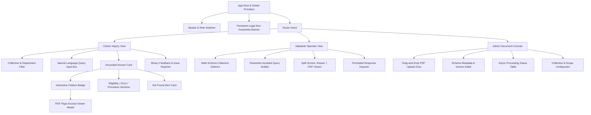
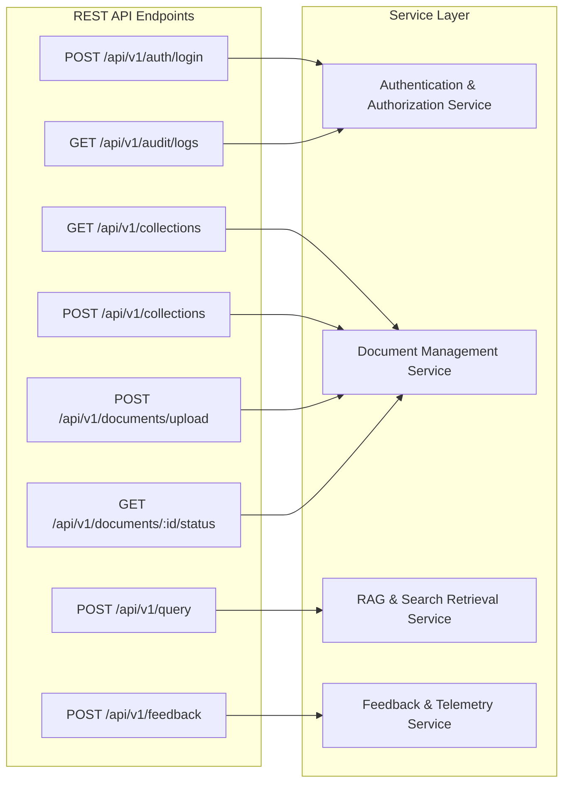
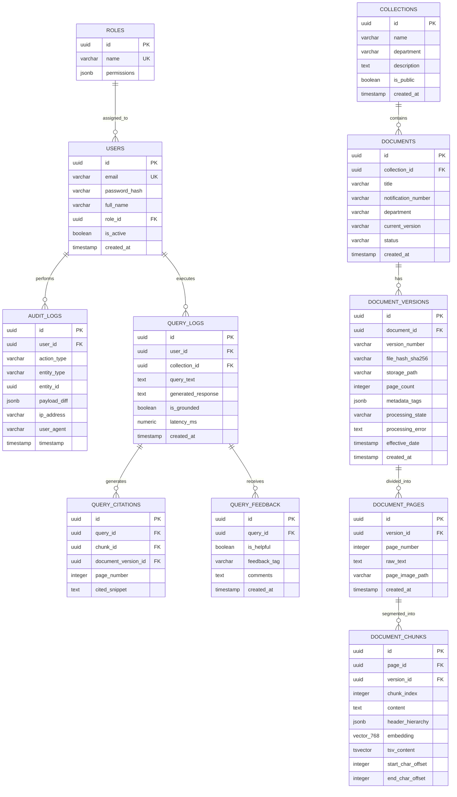
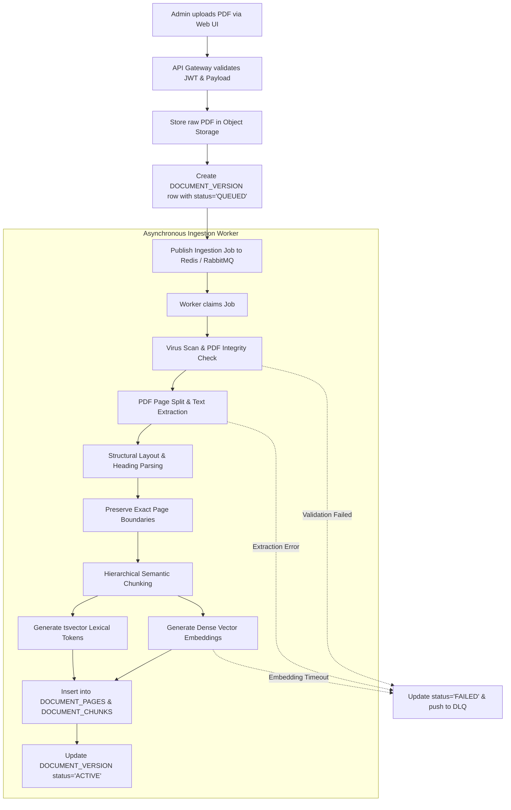
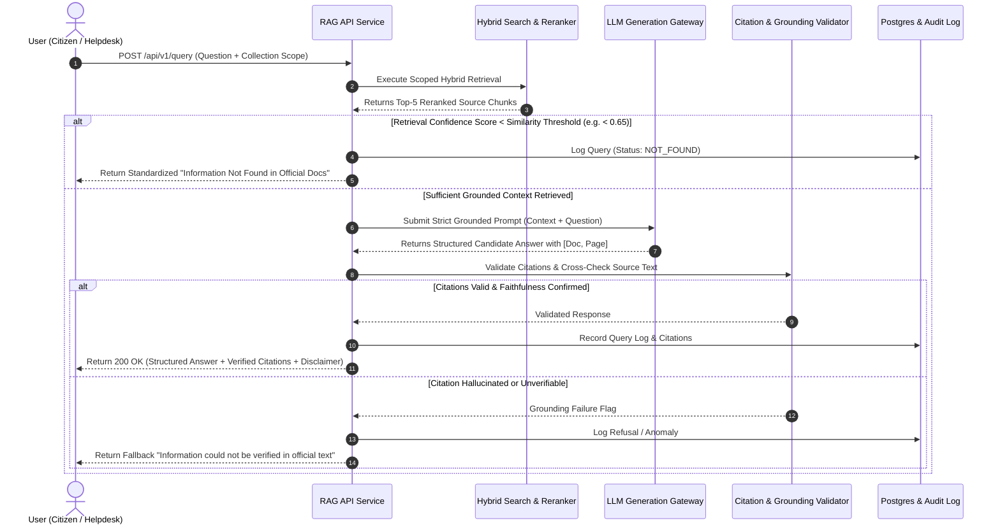
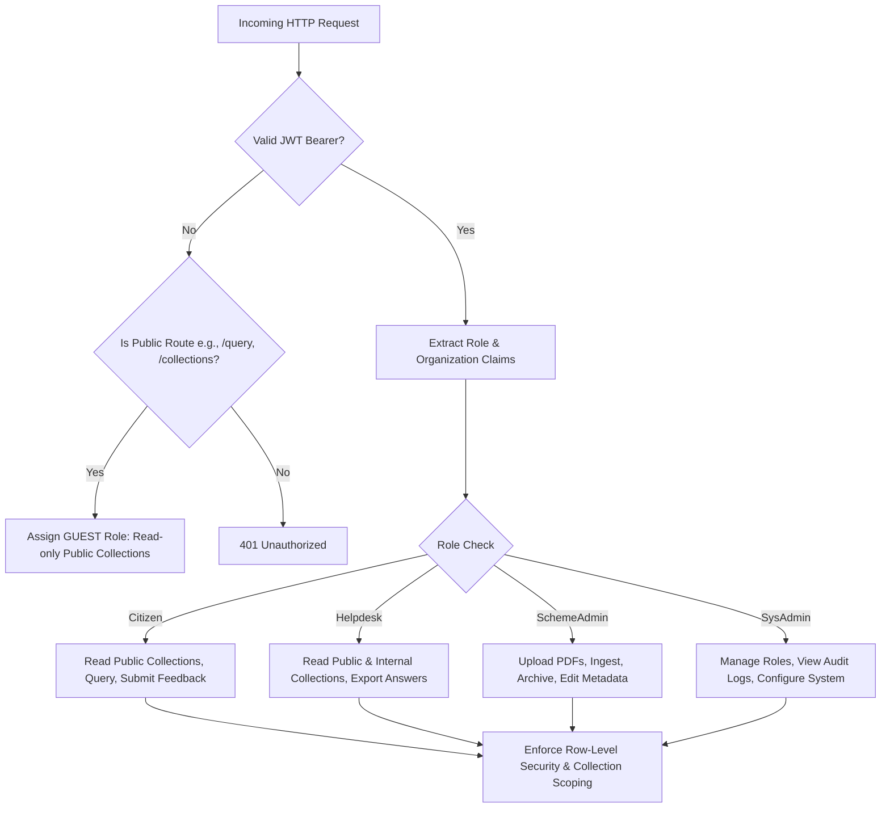
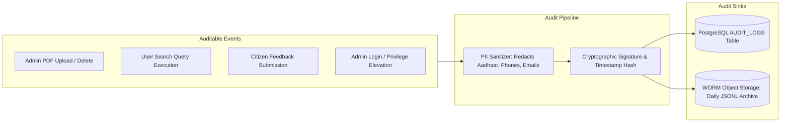
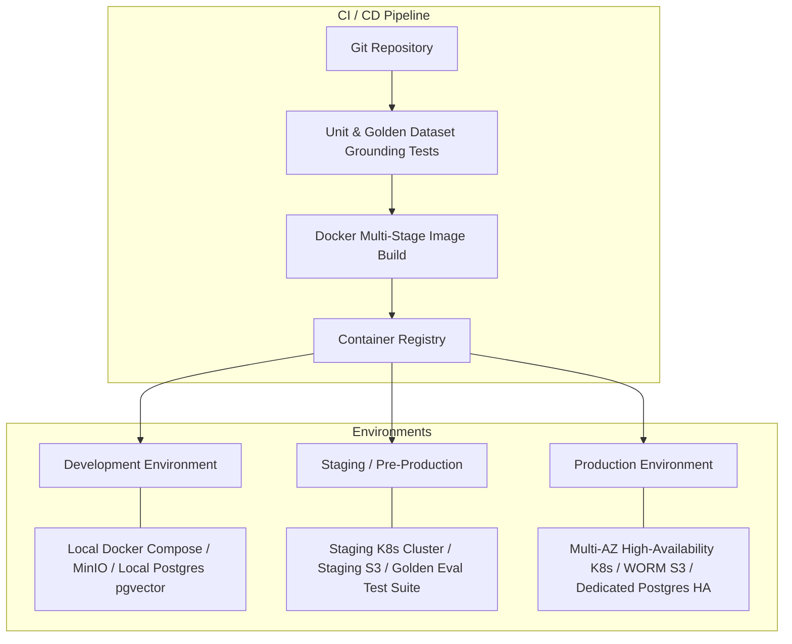

# Technical Architecture Document

## Government Welfare Scheme Document Assistant

**Version:** 1.0  
**Status:** Approved Architectural Blueprint  
**Target Platform:** Web Application (Responsive Desktop & Tablet-Optimized Web)

---

## 1. System Overview & Architecture Topology

The Government Welfare Scheme Document Assistant is architected as a modular, containerized, retrieval-augmented intelligence platform. It enforces **strict document-grounded truth**, **page-level citation determinism**, **isolated multi-collection scoping**, and **asynchronous background document processing**.

```mermaid
graph TB
    subgraph Client_Tier [Client Tier (Responsive Web)]
        CitizenUI[Citizen Query Portal]
        HelpdeskUI[Helpdesk Operator Dashboard]
        AdminUI[Scheme Admin Console]
    end

    subgraph Ingress_Tier [Ingress & Security Tier]
        WAF[WAF / Rate Limiter]
        APIGateway[API Gateway / Reverse Proxy (Nginx/Traefik)]
    end

    subgraph Service_Tier [Application & Microservices Tier]
        AuthService[Auth & Access Control Service]
        CoreAPIService[Core Application API Service]
        RAGService[RAG Retrieval & Generation Engine]
        CitationValidator[Citation & Grounding Validator]
        AuditService[Audit & Telemetry Service]
    end

    subgraph Async_Worker_Tier [Background Processing Tier]
        TaskQueue[Task Queue Broker (Redis / RabbitMQ)]
        DocProcessor[Document Processing Workers]
        EmbedWorker[Embedding & Indexing Workers]
        DeadLetterQueue[Dead Letter Queue (DLQ)]
    end

    subgraph Storage_Tier [Data & Persistence Tier]
        RelationalDB[(PostgreSQL 16 - Relational Data & pgvector)]
        FullTextSearch[(Full-Text Search Engine / BM25 Index)]
        ObjectStore[(Object Storage / S3-Compatible: Raw PDFs & Layouts)]
    end

    subgraph External_Tier [Foundation Model Tier]
        LLMProvider[LLM Inference Endpoint (Private/VPC Isolated)]
        EmbeddingModel[Embedding Model Endpoint (768d/1536d)]
    end

    Client_Tier -->|HTTPS / WSS| WAF
    WAF --> APIGateway
    APIGateway --> AuthService
    APIGateway --> CoreAPIService
    APIGateway --> RAGService

    CoreAPIService --> RelationalDB
    CoreAPIService --> ObjectStore
    CoreAPIService --> TaskQueue

    TaskQueue --> DocProcessor
    DocProcessor --> ObjectStore
    DocProcessor --> EmbedWorker
    EmbedWorker --> EmbeddingModel
    EmbedWorker --> RelationalDB
    EmbedWorker --> FullTextSearch
    DocProcessor -.->|On Failure| DeadLetterQueue

    RAGService --> RelationalDB
    RAGService --> FullTextSearch
    RAGService --> EmbeddingModel
    RAGService --> LLMProvider
    RAGService --> CitationValidator
    CitationValidator --> CoreAPIService

    CoreAPIService --> AuditService
    RAGService --> AuditService
    AuditService --> RelationalDB
```

---

## 2. Frontend Components

The frontend is implemented as a Single Page Application (SPA) / Server-Rendered web application using a modern component-driven UI framework with strict responsive breakpoints (Desktop, Tablet, and Mobile Web).

### 2.1 Component Hierarchy & Tree



### 2.2 Component Specifications

1. **`PersistentDisclaimerBanner`**:
   - Fixed-position banner rendered globally.
   - Clarifies that generated answers are informational and based strictly on published PDF circulars, without statutory legal guarantee.
2. **`CollectionSelector`**:
   - Dynamic dropdown/chip list allowing users to scope search queries to specific scheme categories (e.g., "Agriculture", "Pensions", "Healthcare", or "All Active Collections").
3. **`AnswerCard` & `StructuredSections`**:
   - Renders formatted, deterministic sections: **Summary**, **Eligibility Criteria**, **Required Documents**, and **Application Procedures**.
   - Embeds inline clickable citation pills linked to specific document pages.
4. **`CitationBadge` & `SourcePreviewModal`**:
   - Displays `[Document Name, Page X]`.
   - On click, triggers `SourcePreviewModal`, which fetches the specific page image/excerpt from the Object Store and highlights matching text offsets.
5. **`NotFoundFallback`**:
   - Renders whenever retrieval confidence is below threshold or when the RAG pipeline flags an answer absence.
   - Provides clear next steps (e.g., contacting the departmental helpline) without speculative hallucination.
6. **`DocUploadZone` & `ProcessingTracker`**:
   - Admin-only component for uploading multi-page official PDFs.
   - Displays upload progress, SHA-256 verification, and real-time processing states (`Queued` $\rightarrow$ `Parsing` $\rightarrow$ `Chunking` $\rightarrow$ `Embedding` $\rightarrow$ `Active`).

---

## 3. Backend Services & API Boundaries

The backend consists of well-defined domain services communicating via REST/gRPC, stateless HTTP APIs, and asynchronous message broker queues.



### 3.1 API Contracts

#### Ingestion API

- `POST /api/v1/documents/upload`
  - **Headers:** `Authorization: Bearer <JWT>` (Admin only)
  - **Payload (Multipart Form):**
    - `file`: PDF binary (max 50 MB)
    - `collection_id`: UUID
    - `title`: String
    - `department`: String
    - `notification_number`: String
    - `effective_date`: ISO-8601 Date
    - `version`: String (e.g., "1.0")
  - **Response (202 Accepted):**
    ```json
    {
      "document_id": "9b1deb4d-3b7d-4bad-9bdd-2b0d7b3dcb6d",
      "version_id": "c3a1f8e2-8924-4f0e-b873-12d83f5d1a10",
      "status": "PROCESSING",
      "tracking_url": "/api/v1/documents/9b1deb4d-3b7d-4bad-9bdd-2b0d7b3dcb6d/status"
    }
    ```

#### Query API

- `POST /api/v1/query`
  - **Headers:** `Authorization: Bearer <JWT>` (Optional for Public, Required for Staff)
  - **Payload:**
    ```json
    {
      "query_text": "What is the annual income ceiling for the PM-Kisan subsidy?",
      "collection_ids": ["d4f5e6a7-0000-1111-2222-333344445555"],
      "filters": {
        "department": "Department of Agriculture",
        "effective_after": "2024-01-01"
      }
    }
    ```
  - **Response (200 OK):**
    ```json
    {
      "query_id": "f7e8d9c0-1122-3344-5566-778899aabbcc",
      "status": "SUCCESS",
      "is_grounded": true,
      "answer": {
        "summary": "Under the PM-Kisan subsidy scheme, eligible small and marginal farmer families must not exceed the prescribed institutional landholder exclusion criteria.",
        "eligibility": [
          "Small and marginal farmer families with cultivable landholding up to 2 hectares [PM_Kisan_Guidelines_2024.pdf, Page 4].",
          "Institutional landholders and serving government employees are excluded [PM_Kisan_Guidelines_2024.pdf, Page 5]."
        ],
        "required_documents": [
          "Aadhaar Card [PM_Kisan_Guidelines_2024.pdf, Page 7]",
          "Land Ownership Documents / Record of Rights (RoR) [PM_Kisan_Guidelines_2024.pdf, Page 7]"
        ],
        "citations": [
          {
            "citation_id": "cite-1",
            "document_id": "9b1deb4d-3b7d-4bad-9bdd-2b0d7b3dcb6d",
            "document_title": "PM_Kisan_Guidelines_2024.pdf",
            "page_number": 4,
            "snippet": "Small and marginal farmers having cultivable land up to 2 hectares shall be entitled..."
          },
          {
            "citation_id": "cite-2",
            "document_id": "9b1deb4d-3b7d-4bad-9bdd-2b0d7b3dcb6d",
            "document_title": "PM_Kisan_Guidelines_2024.pdf",
            "page_number": 7,
            "snippet": "Mandatory documentation includes Aadhaar authentication and verified land records..."
          }
        ]
      },
      "disclaimer": "This assistant provides informational summaries based solely on uploaded official scheme documents. It does not constitute legal advice or guarantee eligibility."
    }
    ```

---

## 4. Database Tables & Relationships

The relational schema uses PostgreSQL 16 with the `pgvector` extension for storing chunk vector embeddings alongside relational metadata.



### 4.1 Indexing Strategy

- **`DOCUMENT_CHUNKS.embedding`**: HNSW index (`USING hnsw (embedding vector_cosine_ops) WITH (m = 16, ef_construction = 64)`) for vector similarity search.
- **`DOCUMENT_CHUNKS.tsv_content`**: GIN index (`USING gin(tsv_content)`) for keyword/BM25 text retrieval.
- **Compound Metadata Indexes**: `(version_id, page_id)`, `(collection_id, status)` for collection-scoped filtering.

---

## 5. Object Storage Layout

All uploaded PDF documents, rendered page previews, and extracted layout artifacts are stored in an S3-compatible, immutable object store.

```
s3://welfare-documents-bucket/
├── raw/
│   └── {collection_id}/
│       └── {document_id}/
│           └── {version_id}/
│               └── original.pdf          # Immutable official uploaded PDF
├── processed/
│   └── {version_id}/
│       ├── layout.json                   # Structured layout, headings & bounding boxes
│       └── pages/
│           ├── page_1.png                # Rendered page image for UI citation modal
│           ├── page_1.txt                # Raw extracted page text
│           ├── page_2.png
│           ├── page_2.txt
│           └── ...
└── exports/
    └── audit_reports/
        └── {year}/{month}/{day}/         # Immutable daily audit dumps
```

### 5.1 Storage Policies & Security

- **Server-Side Encryption**: Encrypted at rest using AES-256 (KMS-managed keys).
- **Object Immutability**: `raw/` paths are configured with Object Lock / Write Once Read Many (WORM) policies to prevent tampering with official government circulars.
- **Pre-signed URLs**: UI client accesses page images and excerpts exclusively via short-lived (15-minute expiration) pre-signed URLs.

---

## 6. Document-Processing & Indexing Pipeline

Document ingestion is handled asynchronously via a task-queue architecture to prevent HTTP request timeouts during heavy PDF processing.



### 6.1 Chunking & Page Preservation Algorithm

1. **Page Isolation**: Text is segmented page-by-page. Chunks **never cross page boundaries** without preserving origin page metadata.
2. **Chunk Sizing**: 400–600 tokens per chunk with 50-token overlap within the same page.
3. **Metadata Injection**: Each chunk prepends hierarchical breadcrumbs:
   `[Scheme: {Scheme_Title} | Dept: {Department} | Doc: {Filename} | Page: {Page_Num} | Section: {Header}]`

---

## 7. Keyword and Vector Indexing Flow (Hybrid Search)

The system leverages a **Hybrid Search Pipeline** combining dense semantic embeddings and sparse keyword matching (BM25) to guarantee precise retrieval of scheme acronyms, eligibility numbers, and conceptual queries.

```mermaid
graph TD
    Query[Citizen / Helpdesk Query] --> Normalizer[Query Normalizer & Preprocessor]
    Normalizer --> VectorGen[Generate Query Embedding]
    Normalizer --> LexicalTokens[Generate Lexical Search Query]

    subgraph Scope_Filter [Strict Collection & Metadata Filter]
        Filter[Collection IDs + Dept + Date Filters]
    end

    VectorGen --> DenseSearch[pgvector HNSW Vector Search]
    LexicalTokens --> SparseSearch[PostgreSQL GIN tsvector Search]
    Filter --> DenseSearch
    Filter --> SparseSearch

    DenseSearch --> DenseResults[Top-25 Vector Results (Cosine Score)]
    SparseSearch --> SparseResults[Top-25 Lexical Results (BM25 Score)]

    DenseResults & SparseResults --> RRF[Reciprocal Rank Fusion (RRF) & Normalization]
    RRF --> TopChunks[Top-15 Fused Chunks]
    TopChunks --> CrossEncoder[Cross-Encoder Reranker Model]
    CrossEncoder --> FinalChunks[Top-5 Most Relevant Grounded Chunks]
```

---

## 8. Retrieval and Answer-Generation Flow



### 8.1 Strict System Prompt Template

```text
You are the Government Welfare Scheme Document Assistant. Your role is to provide accurate, factual information about government schemes SOLELY based on the provided official document context.

STRICT OPERATING RULES:
1. Use ONLY the facts directly mentioned in the CONTEXT below. Do NOT use outside knowledge, assumptions, or extrapolations.
2. For every factual claim, bullet point, or rule, you MUST cite the source in the format: [Document Name, Page X].
3. If the answer cannot be completely and unambiguously found in the CONTEXT, you must state: "The requested information is not available in the uploaded official scheme documents."
4. NEVER state or imply that a citizen is guaranteed legal eligibility or entitlement.
5. Structure your output into clear headings: Overview, Eligibility Criteria, Required Documents, and Application Procedure.

---
CONTEXT:
{retrieved_chunk_1}
{retrieved_chunk_2}
{retrieved_chunk_3}
---

USER QUESTION:
{user_query}
```

---

## 9. Authentication and Authorization Boundaries

The platform enforces strict Role-Based Access Control (RBAC) and data isolation:



### 9.1 Source Isolation & Multi-Tenancy

- **Collection Scoping**: Queries must always be bound to explicit `collection_id` filters. The retrieval engine injects `WHERE collection_id IN (...)` at the SQL and vector layer to guarantee no cross-collection leakage.
- **Version Isolation**: Only document chunks belonging to `status = 'ACTIVE'` versions are queried, preventing draft or archived circulars from polluting search results.

---

## 10. Audit Logging & Compliance Architecture

To ensure accountability, transparency, and government audit readiness, every state-changing operation and query execution is immutably logged.



### 10.1 Audit Log Schema Fields

- `event_id` (UUIDv7 - time-sortable)
- `timestamp` (UTC ISO-8601 with microsecond precision)
- `actor_id` (User UUID or `ANONYMOUS_CITIZEN`)
- `ip_address` (Anonymized / masked `/24` subnet for public users)
- `action` (`DOCUMENT_INGEST`, `DOCUMENT_ARCHIVE`, `QUERY_EXECUTE`, `FEEDBACK_SUBMIT`)
- `resource_id` (Target document or collection UUID)
- `query_text_sanitized` (Scrubbed of potential citizen personal identifiers)
- `retrieved_citations` (Array of document IDs and page numbers served)
- `grounding_status` (`GROUNDED`, `REFUSAL_NOT_FOUND`, `VALIDATION_FAILED`)

---

## 11. Failure Handling, Dead-Letter Queues & Retry Behavior

```mermaid
flowchart TD
    Job[Ingestion / Indexing Job] --> Worker[Background Worker]
    Worker --> Exec{Process PDF / Embed}

    Exec -- Success --> Complete[Mark ACTIVE & Notify Admin]

    Exec -- Transient Failure (e.g. Embedding API 503, DB Lock) --> RetryCheck{Retry Count < 3?}
    RetryCheck -- Yes --> Backoff[Exponential Backoff: 2^n * 15s]
    Backoff --> Worker

    RetryCheck -- No --> DLQ[Push to Dead-Letter Queue (DLQ)]
    Exec -- Fatal Error (e.g. Corrupt PDF, Password-Protected) --> DLQ

    DLQ --> Alert[Trigger Admin Error Notification & Mark Version 'FAILED']
    DLQ --> DLQViewer[Admin DLQ Inspection & Manual Re-trigger UI]
```

### 11.1 Retry & Fallback Policies

| Component / Step         | Failure Mode                                               | Retry Policy                                               | Fallback / Circuit Breaker Behavior                                                                            |
| :----------------------- | :--------------------------------------------------------- | :--------------------------------------------------------- | :------------------------------------------------------------------------------------------------------------- |
| **PDF Text Extraction**  | Corrupt PDF / Malformed XRef table                         | 0 retries (Fatal)                                          | Mark document as `FAILED_EXTRACTION`, record exact error trace for Admin review.                               |
| **Embedding Generation** | External API Rate Limit (429) or Service Unavailable (503) | 3 retries with jittered exponential backoff (5s, 15s, 45s) | If exhausted, pause queue, alert administrator, route job to DLQ.                                              |
| **Vector DB Query**      | Query Timeout (> 2000ms)                                   | 1 immediate retry                                          | Fallback to PostgreSQL lexical full-text search (`tsvector`) if vector search times out.                       |
| **LLM Generation**       | LLM API Timeout or Network Disruption                      | 1 retry (timeout 3000ms)                                   | Return graceful degradation message: _"System is currently experiencing high load. Please try again shortly."_ |
| **Citation Validation**  | Post-processing validator detects citation mismatch        | 0 retries                                                  | Reject candidate generation, output deterministic "Not Found in Official Text" refusal.                        |

---

## 12. Environment Configurations & Infrastructure



### 12.1 Environment Matrix

| Parameter                    | Development (Local/CI)               | Staging (Pre-Prod)                                             | Production (Live)                                                    |
| :--------------------------- | :----------------------------------- | :------------------------------------------------------------- | :------------------------------------------------------------------- |
| **Deployment Target**        | Docker Compose / Local Dev           | Managed Kubernetes (K8s) Cluster                               | Multi-AZ High-Availability K8s                                       |
| **Relational & Vector DB**   | PostgreSQL 16 + pgvector (Container) | Managed PostgreSQL (1 Primary, 1 Read Replica)                 | Managed HA PostgreSQL Cluster with Auto-Failover                     |
| **Object Storage**           | Local MinIO Container                | S3-Compatible Object Store (Staging Bucket)                    | S3 Object Store with Object Lock (WORM) & Multi-Region Backup        |
| **Task Queue**               | Redis (Single Node)                  | Redis Sentinel / Managed Redis Cluster                         | Redis Cluster with AOF persistence & Multi-AZ replication            |
| **LLM / Embedding Endpoint** | Mock / Local LLM / Sandbox API Keys  | Private Endpoint Sandbox                                       | VPC-peered Dedicated Private Endpoint / GovCloud Compliant           |
| **Ingress & SSL**            | Localhost Self-Signed / HTTP         | Automated Let's Encrypt TLS 1.3                                | Enterprise Managed WAF + TLS 1.3 + DDoS Shielding                    |
| **Automated Testing**        | Unit, Linting, Integration           | Golden Dataset Faithfulness & Grounding Benchmark ($\ge 99\%$) | Smoke Tests, Synthetic Health Probes & Real-Time Grounding Telemetry |
