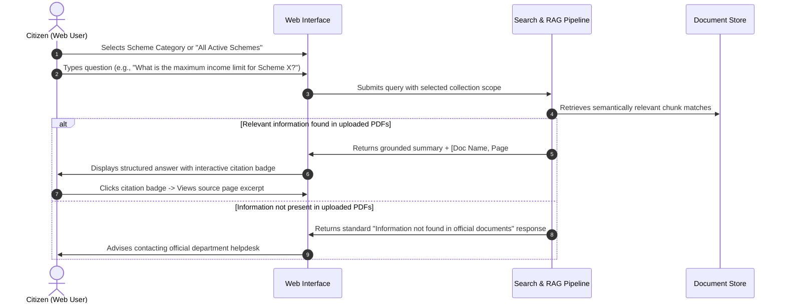
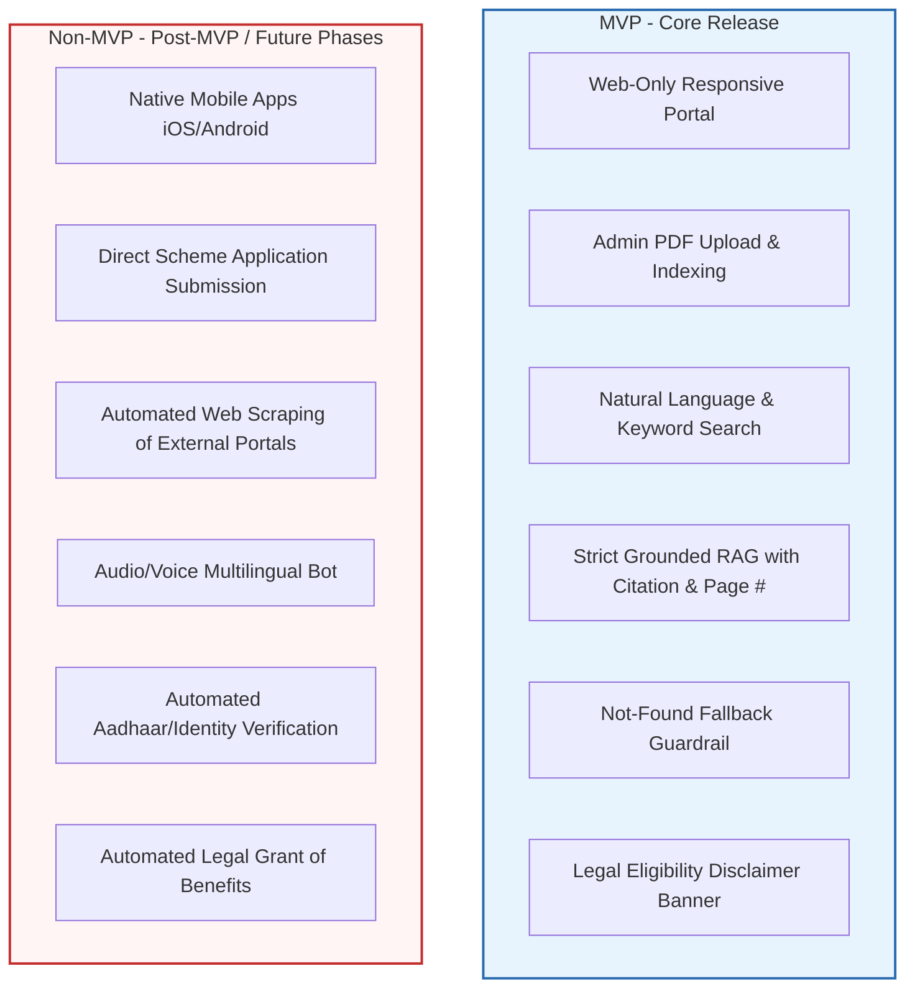
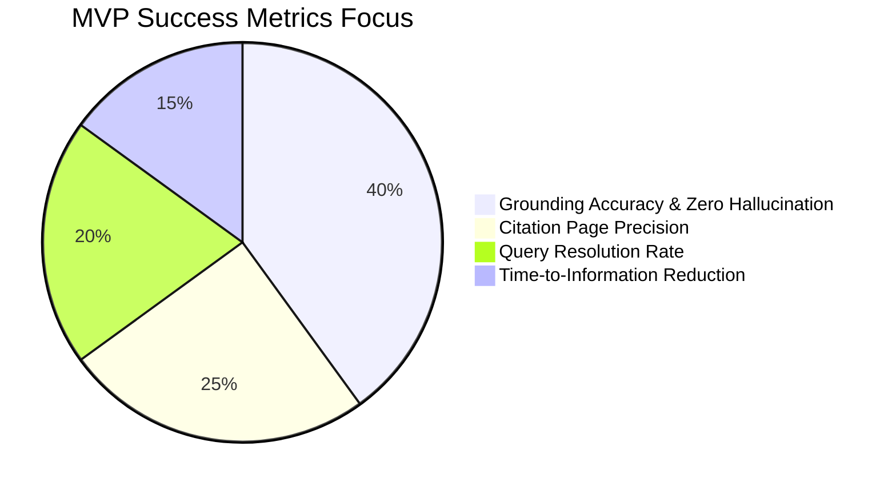

# Product Requirements Document (PRD)

## Government Welfare Scheme Document Assistant (MVP)

**Document Version:** 1.0  
**Status:** Draft / Approved for MVP  
**Target Platform:** Web Application (Responsive Desktop & Tablet-Optimized Web)  
**Author:** Product Management Team

---

## 1. Executive Summary & Problem Statement

### 1.1 Background & Context

Government welfare schemes, eligibility criteria, entitlement matrices, application procedures, and required documentation are fragmented across hundreds of official gazette notifications, operational guidelines, circulars, and PDF policy manuals. Frontline helpdesk workers and citizens struggle to navigate these dense administrative documents, leading to high inquiry backlogs, missed entitlements, misinterpretation of rules, and application rejections.

### 1.2 Product Vision

The **Government Welfare Scheme Document Assistant** is a secure, web-only, retrieval-augmented intelligence tool designed to bridge the gap between complex government documentation and citizen inquiries. It enables authorized administrators to ingest and manage verified policy documents, while empowering citizens and helpdesk operators to query the collection in plain language.

### 1.3 Core Operating Principles

1. **Strict Source-Grounded Truth**: Every answer must be strictly derived _only_ from the selected repository of uploaded official documents. Zero hallucination or ungrounded generative speculation.
2. **Deterministic Citations**: Answers must explicitly cite the official document name and exact page number(s).
3. **Explicit Uncertainty Handling**: If the answer is not present in the indexed documents, the system must clearly state that the information was not found rather than improvising.
4. **No Legal Entitlement Guarantee**: The system provides informational assistance based on published texts; it must never guarantee legal eligibility or grant official sanction.

---

## 2. User Roles and Permissions

| Role                            | Description                                                                                   | Key Permissions & Access Level                                                                                                                                                                                                                                                                 |
| :------------------------------ | :-------------------------------------------------------------------------------------------- | :--------------------------------------------------------------------------------------------------------------------------------------------------------------------------------------------------------------------------------------------------------------------------------------------- |
| **Public Citizen / Guest User** | Unauthenticated or lightly authenticated end-user seeking scheme information.                 | • Select and browse available public scheme document collections. • Search and submit natural-language queries. • View grounded answers with exact document citations and page numbers. • Provide simple feedback (thumbs up/down).                                                   |
| **Helpdesk / Frontline Staff**  | Government support personnel assisting citizens over the phone or at citizen service centers. | • All Citizen capabilities. • Filter queries across administrative departments/categories. • View source snippet previews side-by-side with citations. • Access query history and copy formatted responses with citations for dispatch.                                               |
| **Scheme Administrator**        | Departmental official or content manager responsible for maintaining scheme validity.         | • Upload, replace, archive, and delete official scheme PDFs. • Tag documents with metadata (Department, Scheme Name, Effective Date, Target Demographics). • Trigger document indexing and vectorization pipelines. • Review document parsing status and page-level chunking preview. |
| **System Administrator**        | Technical administrator managing platform security, access, and operations.                   | • Manage user accounts, role assignments, and authentication policies. • Monitor ingestion logs, system latency, vector store health, and error rates. • Configure system guardrails, rate limits, and audit log exports.                                                                |

---

## 3. Main User Journeys

### 3.1 Journey 1: Citizen Inquires About Eligibility & Benefits

### 3.2 Journey 2: Frontline Helpdesk Operator Assisting a Complex Inquiry

1. Operator accesses the authenticated web dashboard.
2. Selects targeted scheme collections (e.g., "Maternity Benefits 2024–2025" and "Rural Housing Guidelines").
3. Enters citizen's situational parameters (e.g., "Applicant is a widowed farmer with 1 hectare land in District Y. Are they eligible for fertilizer subsidy?").
4. System retrieves exact clause-level excerpts and summarizes eligibility clauses, mandatory documentation lists, and application steps.
5. Operator inspects the page-level reference modal, confirms the rule with the citizen, and uses the "Copy Structured Answer" button to deliver the verified guidance.

### 3.3 Journey 3: Administrator Ingesting a Newly Published Scheme Circular

1. Administrator logs into the admin portal and navigates to **Document Management**.
2. Uploads the newly released official PDF (e.g., `Solar_Pump_Subsidy_Rules_2026.pdf`).
3. Inputs metadata: Department Name, Scheme Title, Effective Date, Notification Number.
4. Clicks **Process & Index Document**.
5. System parses PDF text, extracts page boundaries, generates semantic embeddings, and indexes chunks.
6. Administrator verifies parsing success, runs a test query in the verification sandbox, and publishes the document to the active query collection.

---

## 4. MVP vs. Non-MVP Scope Matrix

### 4.1 Detailed Feature Scope

| Feature Category         | MVP Scope (Phase 1)                                                                               | Post-MVP / Out of Scope                                                                                       |
| :----------------------- | :------------------------------------------------------------------------------------------------ | :------------------------------------------------------------------------------------------------------------ |
| **Platform**             | Responsive Web Application (Chrome, Edge, Firefox, Safari desktop & mobile browser view).         | Native iOS / Android applications; WhatsApp / SMS bots.                                                       |
| **Document Ingestion**   | Upload of official PDF files (up to 50MB per file); metadata tagging; page boundary preservation. | Scanned image OCR without text layer; automated web scraping of live government portals; DOCX/PPTX ingestion. |
| **Search & Retrieval**   | Hybrid semantic vector search + keyword search scoped exclusively to uploaded documents.          | Live internet search; ungrounded open-domain LLM general knowledge search.                                    |
| **Response Generation**  | Structured, grounded summaries citing exact Document Name and Page Number(s).                     | Speculative rule generation; legal eligibility determination; multi-turn predictive profiling.                |
| **Safety & Grounding**   | Deterministic fallback when answer is not found; persistent legal non-guarantee disclaimer.       | Autonomous legal advice; automated dispute escalation.                                                        |
| **User Management**      | Role-Based Access Control (Admin vs. Public/Staff) with standard email/password authentication.   | Government SSO (e-Pramaan/DigiLocker integration); public user profile management.                            |
| **Feedback & Analytics** | Basic query logging, thumbs up/down response rating, admin search analytics.                      | Automated model fine-tuning pipeline; automated bias remediation dashboards.                                  |

---

## 5. Functional Requirements

### 5.1 Document Management & Ingestion (Admin)

- **FR-ADM-01: PDF File Upload**: Authorized administrators must be able to upload PDF documents up to 50 MB in size.
- **FR-ADM-02: Metadata Capture**: Ingestion form must require Scheme Name, Issuing Department, Gazette/Notification Number, Effective Date, and Category tags.
- **FR-ADM-03: Page Preservation**: Ingestion pipeline must preserve original page numbers and structural headings during document parsing and vector chunking.
- **FR-ADM-04: Collection Management**: Administrators must be able to group documents into searchable collections (e.g., "Agriculture", "Education", "Healthcare", "State-Specific").
- **FR-ADM-05: Document Status & Lifecycle**: Administrators must be able to view document processing status (`Queued`, `Processing`, `Active`, `Failed`), update metadata, or archive outdated documents.

### 5.2 Retrieval & Query Processing

- **FR-RAG-01: Scope Selection**: Users must be able to select all documents or filter by specific scheme collections/departments before querying.
- **FR-RAG-02: Natural Language Querying**: The system must accept free-form natural language questions (e.g., _"What documents are needed for senior citizen pension?"_).
- **FR-RAG-03: Strict Grounded Synthesis**: The system must generate responses using _only_ retrieved text chunks extracted from the uploaded PDFs.
- **FR-RAG-04: Exact Citation Formatting**: Every substantive statement or bullet point must include an inline citation formatted as `[Document Name, Page X]`.
- **FR-RAG-05: Source Preview Modal**: Clicking any citation badge must open a preview modal displaying the exact page excerpt from the source document.
- **FR-RAG-06: Not Found / Insufficient Context Handling**: When retrieval confidence is below threshold or retrieved context does not contain the answer, the system must output a deterministic message:
  > _"The requested information is not available in the uploaded official scheme documents. Please consult the concerned department or official portal for further clarification."_

### 5.3 User Interface & Trust Experience

- **FR-UI-01: Persistent Legal Disclaimer**: Every search result and answer card must display a visible legal disclaimer:
  > _"Disclaimer: This assistant provides informational summaries based solely on uploaded official scheme documents. It does not constitute legal advice, guarantee eligibility, or confer statutory benefits."_
- **FR-UI-02: Clear Response Formatting**: Responses must be categorized into structured sections where applicable:
  - Summary / Overview
  - Eligibility Criteria
  - Required Documents & Prerequisites
  - Application Procedure & Key Deadlines
  - Source Citations & References
- **FR-UI-03: User Feedback Capture**: Users must be able to submit binary feedback (Helpful / Not Helpful) with optional comment tags (e.g., "Incorrect Citation", "Incomplete Info").

---

## 6. Non-Functional Requirements

### 6.1 Performance & Latency

- **NFR-PERF-01: Query Latency**: 95th percentile (P95) response time for search and grounded answer generation must not exceed 4.5 seconds under standard load.
- **NFR-PERF-02: Ingestion Speed**: Standard 50-page PDF document must be fully parsed, chunked, embedded, and indexed within 90 seconds of upload.
- **NFR-PERF-03: Concurrency**: MVP architecture must support at least 50 concurrent active query sessions without performance degradation.

### 6.2 Accuracy & Grounding Quality

- **NFR-ACC-01: Zero Ungrounded Hallucination**: 100% of factual assertions in generated answers must be directly verifiable against the cited source chunks.
- **NFR-ACC-02: Citation Precision**: 98%+ of citations must point to the exact page where the referenced policy clause is located.
- **NFR-ACC-03: Refusal Reliability**: When tested against out-of-domain or unrepresented queries, the system must refuse with the "Not Found" response in >99% of test cases.

### 6.3 Security, Privacy & Compliance

- **NFR-SEC-01: Web-Only Access Control**: HTTPS-only transport with TLS 1.3 encryption. Role-Based Access Control (RBAC) enforced on all administrative endpoints.
- **NFR-SEC-02: No Citizen PII Retention**: Public query sessions must not log personal identifying information (e.g., Aadhaar number, phone number, physical address).
- **NFR-SEC-03: Document Integrity**: Ingested PDFs must be stored in secure, read-only object storage with SHA-256 integrity verification.

### 6.4 Usability & Accessibility

- **NFR-USE-01: Accessibility**: Web interface must comply with WCAG 2.1 Level AA standards (screen reader support, keyboard navigability, high-contrast ratios).
- **NFR-USE-02: Responsive Design**: Optimized for desktop monitors (1920x1080, 1366x768) and standard tablet viewports (768px+).

---

## 7. Safety, Trust & Hallucination Mitigation Requirements

| Guardrail Pillar                   | Implementation Requirement                                                                                                                            | Failure Mode Prevention                                                                   |
| :--------------------------------- | :---------------------------------------------------------------------------------------------------------------------------------------------------- | :---------------------------------------------------------------------------------------- |
| **Strict RAG Prompt Constraints**  | System prompts must explicitly forbid utilizing external knowledge bases or extrapolating rules not present in the provided context window.           | Prevents model from assuming eligibility rules from other states or obsolete regulations. |
| **Deterministic Negative Answers** | Strict similarity distance thresholds; if top vector matches score below threshold, skip generation and return the standardized "Not Found" template. | Eliminates fabricated procedural steps for missing schemes.                               |
| **Mandatory Citation Enforcement** | Post-generation verification step checks if citations match retrieved source IDs and page metadata before rendering.                                  | Prevents hallucinated page numbers or ghost document names.                               |
| **Non-Guarantee of Eligibility**   | Hard-coded UI banners and contextual response footers emphasize non-binding status.                                                                   | Protects government agency from legal liability or disputed citizen claims.               |
| **Prohibited Actions**             | System must refuse prompts asking it to generate fraudulent exemption claims, bypass mandatory verification documents, or evaluate personal disputes. | Protects against adversarial jailbreaks or policy abuse.                                  |

---

## 8. Success Metrics & Key Performance Indicators (KPIs)

### 8.1 Quantitative KPIs

1. **Faithfulness & Grounding Rate**: $\ge 99\%$ of generated answers verified as strictly faithful to source text in automated golden-dataset evaluations.
2. **Citation Page Accuracy**: $\ge 98\%$ of inline citations reference the exact page containing the rule.
3. **Appropriate Refusal Rate**: $\ge 95\%$ correct refusal on unanswerable/out-of-corpus queries.
4. **Time to Answer**: Mean query turnaround time under 3 seconds.
5. **Helpdesk Efficiency**: 40% reduction in time frontline operators spend searching for policy clauses during citizen assistance calls.

### 8.2 Qualitative Metrics

1. **User Trust Score**: $\ge 85\%$ positive sentiment on source document transparency and clarity of citations.
2. **Admin Operational Satisfaction**: Ability for non-technical administrators to upload and activate a new policy circular within 3 minutes.

---

## 9. Explicit Exclusions & Anti-Goals

To maintain strict delivery timelines and safety boundaries for the MVP, the following are explicitly **out of scope**:

- ❌ **No Mobile Native Apps**: This is strictly a web application; no iOS, Android, or desktop executable builds will be developed in MVP.
- ❌ **No Guaranteed Legal Determinations**: The system will never issue a statement declaring a user definitively "approved" or legally entitled to funds.
- ❌ **No Live Application Filing or Transactional Workflows**: The system will not integrate with payment gateways, citizen application forms, or scheme disbursement portals.
- ❌ **No External Internet Browsing**: The system will not crawl arbitrary external URLs, government news feeds, or third-party blogs.
- ❌ **No Automated Aadhaar / Identity Verification**: No integration with citizen identity registries or biometrics in the MVP phase.
- ❌ **No Rule Synthesis Across Inconsistent Documents**: If two uploaded documents contradict each other, the system must highlight the disparity and cite both rather than deciding which rule takes precedence.
