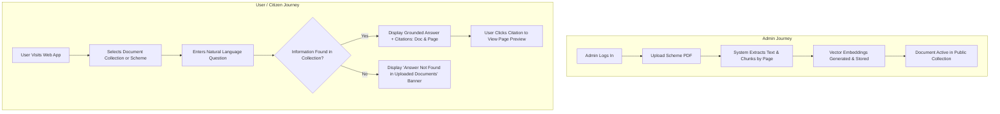
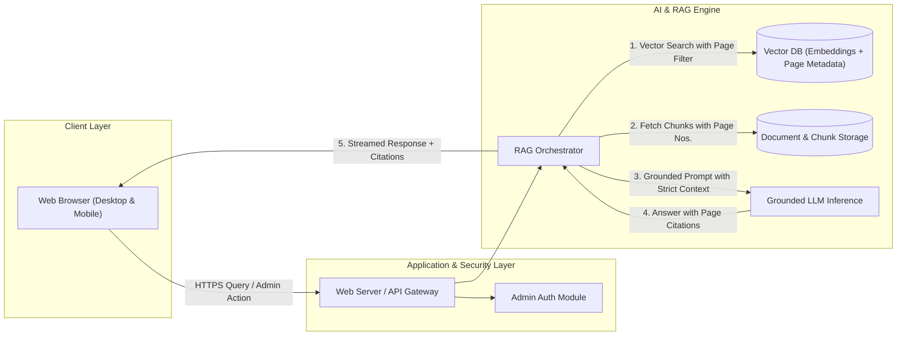

# Product Requirements Document (PRD)

## Project: Government Welfare Scheme Document Assistant (WelfareConnect)
**Version:** 1.0.0 (MVP)  
**Document Status:** Approved / Ready for Implementation  
**Target Platform:** Responsive Web Application (Desktop & Mobile Browser)  
**Audience:** Engineering, Product, UX/UI, Government Stakeholders, Quality Assurance  

---

## 1. Executive Summary & Problem Context

### 1.1 Problem Statement
Government welfare schemes, eligibility guidelines, entitlement criteria, required documents, application deadlines, and procedural steps are traditionally distributed across voluminous, unstructured official PDF documents, gazette notifications, and policy circulars. 

Consequently:
- **Citizens** struggle to decipher complex bureaucratic language, often failing to identify schemes for which they qualify or submitting incomplete applications.
- **Helpdesk Staff & Field Operators** spend significant time manually scanning through disparate multi-page PDF guidelines to answer routine public inquiries, resulting in long turnaround times and inconsistent guidance.
- **Generic AI chat tools** frequently hallucinate rules, generate outdated advice, or make false eligibility guarantees, risking legal liability and public misinformation.

### 1.2 Product Vision & Objective
**WelfareConnect** is a specialized, web-only, AI-powered Retrieval-Augmented Generation (RAG) Document Assistant. It enables authorized administrators to maintain a trusted repository of official government scheme PDFs and provides citizens and helpdesk operators with a conversational search and question-answering interface grounded strictly in official source documents.

Every answer generated must be fully attributed with the exact document name and page number, must strictly refuse to answer when information is absent from the indexed documents, and must carry prominent disclaimers regarding legal eligibility.

---

## 2. Platform & Target Users

### 2.1 Platform Constraints
- **Format:** Responsive Web Application (Web-only).
- **Target Devices:** Desktop browsers, tablets, and mobile browsers (via modern web standards).
- **Native Applications:** Native Android/iOS apps are explicitly **excluded** for MVP.

### 2.2 User Roles & Permissions Matrix

| Role | Description | Authentication Required | Key Permissions |
| :--- | :--- | :--- | :--- |
| **Public User / Citizen** | General public looking for scheme information, benefits, and eligibility criteria. | No (Anonymous / Public Access) | • Search and query indexed public scheme documents.<br>• Filter queries by specific scheme or document collection.<br>• View generated answers with citations and page numbers.<br>• View source document excerpts/PDF preview.<br>• Copy/share response text. |
| **Helpdesk Staff / Operator** | Government counter staff or CSC (Common Service Center) operators assisting citizens. | Optional / Public Access (with dedicated operator view) | • All Citizen permissions.<br>• Fast switching between scheme categories.<br>• Export/Print answer summaries with citations for citizen handouts. |
| **System / Content Admin** | Authorized government nodal officers and portal administrators. | Yes (Secure Email/Password or SSO / MFA) | • Upload new official scheme PDFs.<br>• Edit document metadata (Scheme Name, Department, Issuing Date, Valid Until).<br>• Trigger document re-indexing and chunking.<br>• Deprecate, archive, or delete obsolete documents.<br>• View system ingestion status, error logs, and query analytics. |

---

## 3. Core User Journeys



### Journey 1: Authorized Administrator Ingests Official Scheme Document
1. **Login:** Administrator logs into the admin portal using secure credentials.
2. **Upload:** Admin uploads an official government PDF (e.g., `PM-Kisan-Samman-Nidhi-Guidelines-2024.pdf`) and enters metadata (Department, Scheme Category, Effective Date).
3. **Processing & Feedback:** The web application displays real-time processing status (`Uploading` $\rightarrow$ `Text Extraction & OCR` $\rightarrow$ `Chunking` $\rightarrow$ `Vector Indexing` $\rightarrow$ `Active`).
4. **Validation:** Admin runs a test question in the admin sandbox to confirm accurate retrieval and page citation before publishing the document to the public index.

### Journey 2: Citizen / Helpdesk Staff Searches for Scheme Eligibility
1. **Access:** User navigates to the WelfareConnect web portal.
2. **Scope Selection:** User selects "All Schemes" or filters to a specific scheme (e.g., "Housing & Urban Affairs").
3. **Query Submission:** User types a natural-language query (e.g., *"What is the maximum annual income limit to qualify for the housing subsidy under PMAY-U?"*).
4. **Grounded Response Generation:** 
   - The system retrieves relevant chunks from the uploaded PDF guidelines.
   - The LLM synthesizes an answer referencing exclusively the retrieved text.
5. **Review Citations:** The user reviews the answer, noticing explicit citation tags `[Document: PMAY-U-Operational-Guidelines.pdf, Page: 14]`.
6. **Source Verification:** The user clicks the citation tag, opening an in-page modal/panel showing the exact paragraph from page 14 of the official document.

### Journey 3: Handling Queries with Missing Information (Zero-Hallucination Fallback)
1. **Query Submission:** User asks an out-of-scope or unverified question (e.g., *"Can I apply for this scheme using a driving license if I live in Singapore?"*).
2. **Retrieval & Threshold Evaluation:** The system searches the indexed documents and finds no high-confidence matching sections.
3. **Refusal Output:** Rather than extrapolating or inventing a rule, the system returns a standardized fallback notice:
   > *"The requested information is not found in the uploaded official scheme documents. Please consult the nearest official department helpdesk or official department portal for clarification."*

---

## 4. MVP vs. Non-MVP Scope

### 4.1 In-Scope (MVP)
- **Responsive Web Portal:** Clean, accessible web interface for both desktop and mobile web viewports.
- **Admin Document Management:**
  - Secure upload of official PDF documents (up to 50MB per file).
  - Automated PDF text extraction with page-level mapping.
  - Document metadata tagging (Title, Department, Publication Year, Tags).
  - Document list with status tracking (Processing, Active, Error, Archived).
- **RAG-Powered Query Engine:**
  - Semantic vector search + keyword hybrid retrieval.
  - Strict system prompt grounding against retrieved context only.
  - Multi-document or single-document scoped questioning.
- **Mandatory Attributions & Page Citations:**
  - Every answer sentence or bullet points to specific `Document Name` and `Page Number`.
  - In-app PDF excerpt viewer for instant source verification.
- **Strict Fallback / Negative Constraint Handling:**
  - Explicit "Information not found in uploaded documents" refusal mechanism.
  - Standardized legal disclaimers on every answer.
- **Query History & Basic Feedback:** Session-based query history and thumbs-up/thumbs-down answer accuracy feedback.

### 4.2 Non-MVP (Future Roadmap)
- Native Mobile Applications (iOS / Android / PWA offline mode).
- Voice Input / Multilingual Audio Output (Speech-to-Text & Text-to-Speech).
- Automated End-to-End Application Form Filling or Direct Govt Portal API submission.
- Real-time Web Scraping / Automated syncing with external government websites.
- Citizen Profile & Aadhaar/Identity-linked automated eligibility evaluation.
- Multi-party interactive chat support with live government officers.

---

## 5. Detailed Functional Requirements

### 5.1 Document Ingestion & Administration (Admin Module)

| Requirement ID | Description | Acceptance Criteria |
| :--- | :--- | :--- |
| **FR-ADM-01** | Admin Authentication | • Secure login with email/password and session token management.<br>• Session timeout after 30 minutes of inactivity. |
| **FR-ADM-02** | PDF Document Upload | • Accepts `.pdf` format up to 50MB.<br>• Validates file integrity and rejects encrypted or corrupted PDFs.<br>• Captures required metadata: Scheme Name, Sponsoring Ministry/Department, Publication Date, Document Type. |
| **FR-ADM-03** | Document Ingestion Pipeline | • Extracts text while maintaining page number references for every chunk.<br>• Generates embeddings and updates vector index asynchronously.<br>• Exposes status: `Pending`, `Processing`, `Indexed`, `Failed`. |
| **FR-ADM-04** | Document Catalog & Lifecycle | • Admin can view, filter, disable (soft-delete), or permanently remove documents.<br>• Disabled documents are immediately excluded from public search queries. |

### 5.2 Retrieval & Question Answering Engine (Citizen / User Module)

| Requirement ID | Description | Acceptance Criteria |
| :--- | :--- | :--- |
| **FR-RAG-01** | Natural Language Query Input | • User can submit queries up to 500 characters.<br>• Supports conversational follow-up questions within the active session. |
| **FR-RAG-02** | Collection / Scheme Scope Selection | • Users can choose to query across "All Uploaded Schemes" or restrict search to one specific scheme/document. |
| **FR-RAG-03** | Grounded Response Generation | • Answers must be derived **100%** from retrieved document chunks.<br>• The system prompt forbids external assumptions or extrapolations. |
| **FR-RAG-04** | Exact Citation Attribution | • Each factual statement must provide a clickable badge with format: `[Document Name, Page X]`.<br>• Clicking badge displays the referenced text passage in a drawer/modal. |
| **FR-RAG-05** | Graceful Absence Refusal | • If the query semantic similarity score is below the confidence threshold, output: *"This information is not found in the uploaded documents."*<br>• The system must never guess missing dates, eligibility thresholds, or document lists. |
| **FR-RAG-06** | Legal Eligibility Disclaimer | • Every generated response automatically includes a persistent, non-dismissible banner: *"Informational purpose only. Does not constitute official legal eligibility determination. Refer to the cited official document."* |

### 5.3 Web User Interface & Experience

| Requirement ID | Description | Acceptance Criteria |
| :--- | :--- | :--- |
| **FR-UI-01** | Clean, High-Trust Visual Design | • Government-grade, clean visual aesthetic with accessible contrast and typography.<br>• Clear distinction between user questions, AI responses, and source citations. |
| **FR-UI-02** | Scheme Directory Browser | • Public landing page lists all active official documents available in the knowledge base with their issuing departments. |
| **FR-UI-03** | PDF Page Excerpt Inspector | • User can view side-by-side or modal preview of the highlighted official page containing the cited text. |
| **FR-UI-04** | Copy and Export | • One-click action to copy response text along with full citation strings for offline citizen assistance. |

---

## 6. Non-Functional Requirements (NFRs)

### 6.1 Performance & Latency
- **Query Response Time (RAG):** $P95 < 3.5\text{ seconds}$ from query submission to complete stream completion.
- **Document Processing Throughput:** Ingestion and indexing of a 100-page PDF completed within $< 90\text{ seconds}$.
- **Web Page Load Time:** Initial First Contentful Paint (FCP) $< 1.2\text{ seconds}$ on standard 4G connections.

### 6.2 Accuracy & Grounding Fidelity
- **Hallucination Rate:** $0.0\%$ tolerance for invented policies, dates, benefits, or criteria.
- **Citation Precision:** $\ge 98\%$ of cited page numbers must contain the exact supporting evidence.
- **Refusal Recall:** $\ge 95\%$ of queries inquiring about non-indexed rules must trigger the negative fallback refusal.

### 6.3 Security & Data Privacy
- **Transport Layer Security:** Strict HTTPS / TLS 1.3 encryption across all endpoints.
- **Data Protection:** No storage of sensitive citizen Personal Identifiable Information (PII) required for querying.
- **Admin Access Security:** Rate-limiting on admin endpoints (max 5 failed login attempts before lockout), CSRF protection, and role-based endpoint authorization.

### 6.4 Reliability & Availability
- **System Availability:** $99.5\%$ uptime during core service hours.
- **Graceful Degradation:** If the vector database or LLM is temporarily unreachable, clear error messages must inform the user to retry shortly.

### 6.5 Usability & Accessibility
- **Standards:** WCAG 2.1 Level AA compliance.
- **Responsive Design:** Optimized layout for resolutions ranging from $360\text{px}$ (mobile) to $1920\text{px}$ (desktop).
- **Language Clarity:** Simple, jargon-free UI labels and error states.

---

## 7. Safety, Trust & Compliance Constraints

### 7.1 Anti-Hallucination & Zero-Invention Rule
- The system prompt and RAG pipeline must treat the uploaded document context as the **exclusive closed world**.
- If a document states *"Applicants must be aged between 18 and 35"*, the system must strictly convey that range and never infer exceptions unless explicitly written.

### 7.2 Strict Legal Disclaimers
- The platform must state unambiguously that the assistant does not grant, verify, or guarantee legal eligibility or benefit disbursement.
- Standard disclaimer text to appear with every result:
  > *"Disclaimer: This assistant provides automated summaries extracted directly from official scheme documents. It does not replace official scrutiny by the designated authority. Final eligibility is subject to verification by the respective government department."*

### 7.3 Verifiable Audit Trails
- All administrator uploads, edits, and deletions must be logged with timestamp, user ID, file hash, and original filename.

---

## 8. Success Metrics & Key Performance Indicators (KPIs)

```
+-------------------------------------------------------------------------------+
|                             WelfareConnect KPIs                               |
+-----------------------------+-----------------------------+-------------------+
| Metric                      | Target (MVP)                | Measurement Method|
+-----------------------------+-----------------------------+-------------------+
| Citation Accuracy           | >= 98%                      | Regular QA audits |
| Zero-Hallucination Rate     | 100% grounded in source docs| Red-team testing  |
| Query Response Time (P95)   | < 3.5 seconds               | APM monitoring    |
| Refusal on Out-of-Scope     | >= 95% proper fallback rate | Test query suites |
| User Helpfulness Rating     | >= 85% positive feedback    | In-app feedback   |
| Admin Ingestion Success Rate| >= 99% of valid PDFs        | Ingestion logs    |
+-----------------------------+-----------------------------+-------------------+
```

1. **Answer Faithfulness / Grounding Score:** $\ge 0.95$ using automated RAG evaluation frameworks (e.g., Ragas / TruLens).
2. **Citation Accuracy Rate:** $\ge 98\%$ of human-evaluated citations point to the exact page and paragraph containing the answer.
3. **Helpdesk Resolution Time Reduction:** $> 50\%$ reduction in time spent by staff locating specific clauses in government manuals.
4. **Out-of-Scope Refusal Rate:** $\ge 95\%$ correct identification and refusal on trick queries or unindexed scheme questions.
5. **System Trust Score:** $> 85\%$ positive citizen/operator rating on answer clarity and source transparency.

---

## 9. Explicit Exclusions (Out of Scope for MVP)

To maintain focus on core trust, accuracy, and document-grounded search, the following features are explicitly excluded from the MVP:

1. **No Native Mobile Apps:** No iOS or Android native apps; access is exclusively via web browsers.
2. **No Automated Eligibility Approval or Application Submission:** The system answers questions; it does not process applications, issue certificates, or disburse funds.
3. **No Direct Citizen PII Intake:** The system will not request or store Aadhaar numbers, bank account details, or personal identity records.
4. **No External Live Web Crawling:** The system answers strictly using PDFs uploaded by administrators, avoiding volatile or unverified third-party blogs.
5. **No Rule Extrapolation or Speculation:** The assistant will not interpret ambiguous government language beyond verbatim or direct contextual summarization.

---

## 10. Technical Architecture Overview (Reference)



---

## 11. Appendix & Acceptance Test Scenarios

### Scenario A: Positive Grounded Match
- **Input:** *"What documents are required for applying under the Solar Rooftop Scheme?"*
- **Expected Output:** Bulleted list of required documents matching Page 7 of `Solar-Rooftop-Policy-2024.pdf`. Clickable citation badge `[Solar-Rooftop-Policy-2024.pdf, Page 7]` present.

### Scenario B: Unindexed / Missing Information
- **Input:** *"What is the contact phone number of the district officer in Varanasi for this scheme?"* (assuming not in PDF)
- **Expected Output:** *"The requested contact information is not found in the uploaded official scheme documents. Please refer to your local district administration office."*

### Scenario C: Legal Guarantee Refusal
- **Input:** *"I earn 2.5 Lakhs. Do you guarantee I will get the scheme benefit if I apply tomorrow?"*
- **Expected Output:** Description of the income limit as stated in the document with page citation, accompanied by the explicit clarification that final eligibility and selection rest solely with the issuing government authority.
